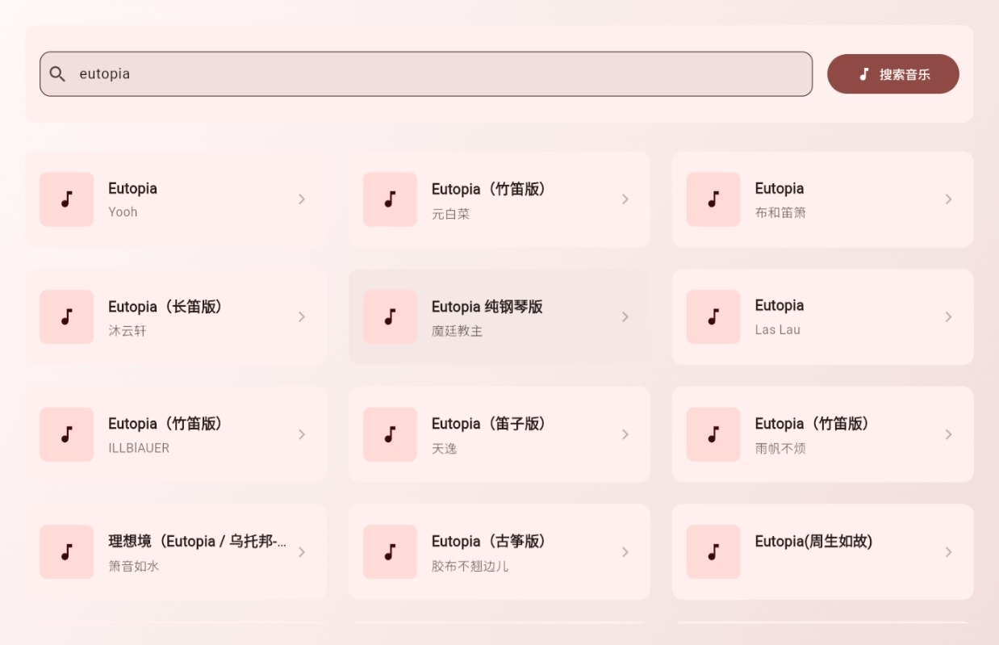
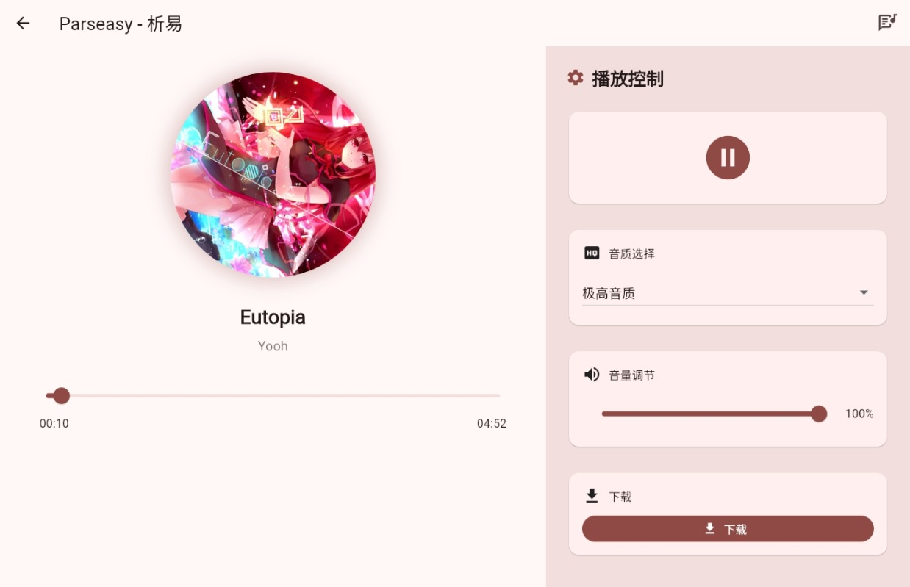
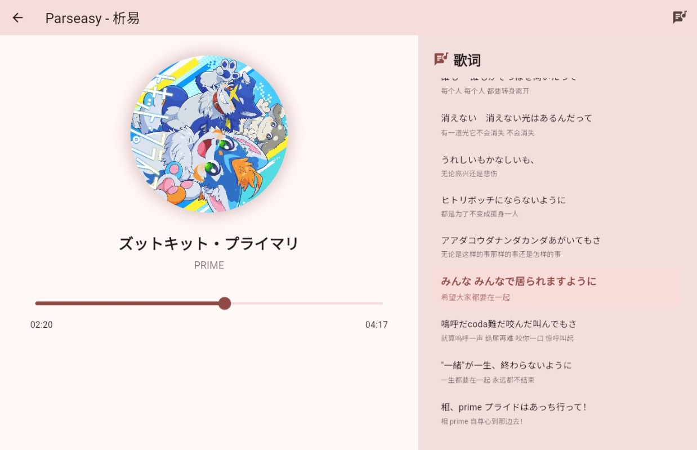

<p align="center">
  
</p>

<h1 align="center">🎵 Parseasy</h1>

<p align="center">
  <b>Landscape Music Player Framework built with Flutter</b><br/>
  A customizable, extensible, landscape-oriented music player UI
</p>

<p align="center">
  <a href="https://flutter.dev">
    
  </a>
  <a href="https://dart.dev">
    
  </a>
  <a href="LICENSE">
    
  </a>
</p>

---

## ✨ Overview

**Parseasy** is a **landscape-oriented music player framework** built with Flutter.

It focuses on:
- Player UI
- Playback control logic
- Extensible data source architecture

This project **does not include any built-in music source**.  
All music data must be provided by the user through **custom implementations**.

**However, there is a third-party API for testing non-commercial to use**
./T-API.md


---

## ✨ Features

- 🎧 Landscape-first UI design (tablet / car display friendly)
- 🧩 Pluggable music source architecture
- 🎮 Playback controls and playlist logic
- 📱 Flutter-based, cross-platform ready
- 🛠 Clean and extensible code structure

---

## 📸 Screenshots

<p align="center">
  
  
  
</p>

> Screenshots are for UI demonstration only

---

## 🚀 Getting Started
**Code in the master branch**

### Clone the repository

```bash
git clone https://github.com/yourname/parseasy.git
cd parseasy
```

### Install dependencies

```bash
flutter pub get
```

### Run the app

```bash
flutter run
```

---

## 🧩 Music Source Architecture

Parseasy is designed to work with **user-provided music sources**.

Example (interface only):

```dart
class ApiService {
  static const String searchApi = 'api_search';
  static const String parseApi = 'api_music';

```

> Implementations are intentionally **not included** in this repository.

---

## ⚠️ Legal Disclaimer

- This project is a **client-side music player framework only**
- It does **not host, store, or distribute** any music content
- No third-party music services or APIs are bundled
- The author does **not provide or endorse** any music source
- Users are responsible for ensuring legal compliance when implementing custom sources

---

## 📄 License

This project is licensed under the **MIT License**.  
See the [LICENSE](LICENSE) file for details.

---

**If you find this project helpful, please consider giving it a ⭐️.**

